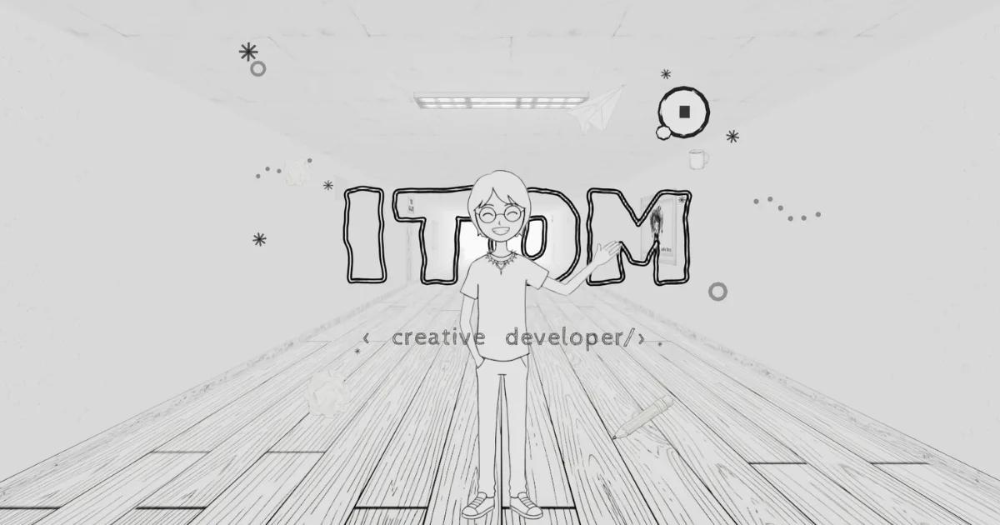

# Shashank Singh — Creative 3D Portfolio

<p align="center">
  
</p>

<p align="center">
  <strong>An interactive 3D portfolio built to showcase my projects, skills, achievements and journey as a student developer.</strong>
</p>

<p align="center">
  <a href="https://github.com/sh4shanks">
    
  </a>
  <a href="mailto:shashank2009s24@gmail.com">
    
  </a>
  <a href="https://www.instagram.com/_shashank2467">
    
  </a>
</p>

---

## ✨ Overview

Welcome to my interactive 3D portfolio.

Instead of presenting my work as a traditional collection of pages, this portfolio uses an interactive 3D environment where visitors can explore different sections, discover projects and learn more about me.

The website combines **React, Three.js, React Three Fiber and modern web technologies** to create an immersive portfolio experience.

The project is designed around the idea of turning a portfolio into an **interactive digital space** rather than a conventional website.

---

## 👨‍💻 About Me

Hi, I'm **Shashank Singh**, a student developer interested in software development, interactive web experiences, AI-powered applications and creative technology.

I enjoy turning ideas into working projects and experimenting with technologies such as:

- React
- JavaScript
- Three.js
- React Three Fiber
- HTML & CSS
- Node.js
- Git & GitHub
- AI-assisted development
- Interactive UI/UX
- Creative web experiences

I also enjoy building projects that combine functionality with strong visual design.

---

## 🎯 Portfolio Goals

This portfolio was created to:

- Showcase my development projects
- Experiment with 3D web development
- Present my achievements
- Demonstrate frontend development skills
- Explore interactive user experiences
- Create a unique personal identity online
- Document my journey as a student developer

---

# 🚀 Featured Projects

## 🎮 Games

### CricketVerse

A cricket-focused interactive game project designed around an engaging digital cricket experience.

**Focus:**
- Game mechanics
- Interactive UI
- Player interaction
- Web-based gaming

---

### CodeQuest

A coding-themed game concept that combines programming challenges with interactive gameplay.

**Focus:**
- Logic
- Problem solving
- Interactive challenges
- Gamification

---

### CyberTrace

A cybersecurity-themed interactive game based around investigation, digital clues and cyber challenges.

**Focus:**
- Cybersecurity concepts
- Investigation mechanics
- Interactive gameplay
- Problem solving

---

# 🌐 Websites & Applications

## iOS Glass Chess

A modern chess experience inspired by Apple's glass-like interface design language.

**Highlights:**

- Glassmorphism UI
- Responsive design
- Chess board interaction
- Modern animations
- Desktop and mobile support

---

## CyberShield

A cybersecurity-focused web application designed to present security-related information and tools through a modern interface.

**Focus:**

- Cybersecurity awareness
- Security concepts
- Modern UI
- Interactive components

---

## Health Monitor

A health-focused interface concept designed to present health and activity information through a clean dashboard experience.

**Focus:**

- Dashboard design
- Data visualization
- Responsive UI
- User-friendly interface

---

## SportsCommentary

A sports commentary web experience designed around presenting live-style sports information and commentary in an interactive interface.

**Focus:**

- Sports interfaces
- Dynamic information
- Interactive UI
- Responsive design

---

# 🏆 Achievements

## 🥇 1st Place — Infantino Mark 5

Secured **1st place** at Infantino Mark 5 held at my school.

For the event, I built a **robot car using Arduino Uno**, combining electronics, programming and hardware.

**Project:**
- Arduino Uno
- Robot car
- Hardware integration
- Programming
- School technology event

---

## 🎪 Organizer — SJS Talentia 2025

Organized and coordinated **SJS Talentia 2025**, a major event at my school.

The experience involved planning, coordination, teamwork and helping manage the event.

---

# 🧠 Technologies Used

The portfolio uses a combination of modern frontend and 3D technologies.

| Technology | Purpose |
|---|---|
| React | UI and application structure |
| JavaScript | Application logic |
| Three.js | 3D graphics |
| React Three Fiber | React-based Three.js rendering |
| Vite | Development and build tooling |
| HTML5 | Web structure |
| CSS | Styling and layout |
| Git | Version control |
| GitHub | Source code hosting |

---

# 🎨 Design

The portfolio uses an immersive 3D environment rather than a traditional page-based layout.

### Design principles

- Interactive 3D environment
- Dark visual aesthetic
- Minimal interface
- Smooth transitions
- Immersive navigation
- Interactive rooms
- Animated elements
- Responsive experience

The 3D environment acts as the main navigation system of the portfolio.

---

# 🧩 Portfolio Structure

The experience is organized into different interactive areas.

```text
Portfolio
│
├── Home
│
├── About
│   ├── Introduction
│   ├── Journey
│   └── Personal Information
│
├── Projects
│   ├── Games
│   │   ├── CricketVerse
│   │   ├── CodeQuest
│   │   └── CyberTrace
│   │
│   └── Websites
│       ├── iOS Glass Chess
│       ├── CyberShield
│       ├── Health Monitor
│       └── SportsCommentary
│
├── Achievements
│   ├── Infantino Mark 5
│   └── SJS Talentia 2025
│
├── Studio
│
└── Contact
